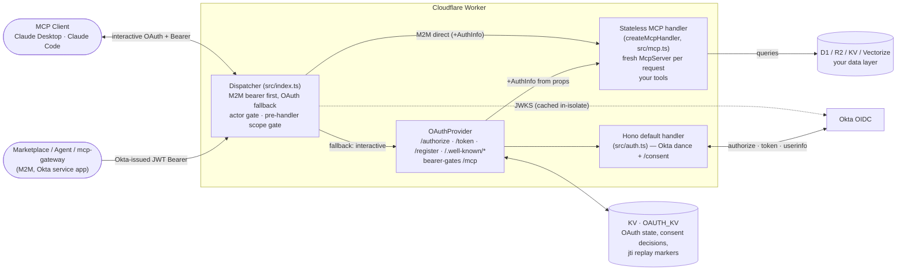

# Architecture: MCP Servers on Cloudflare Workers

Stack, storage model, and best practices for building MCP servers on Cloudflare Workers using the pattern in this skill — **stateless MCP (spec 2026-07-28)** on `@modelcontextprotocol/server` v2, with Okta OAuth for interactive clients and Okta-issued M2M bearer JWTs, verified locally, for agents.

## Stack at a glance



## Operating model: agentic, remote-only

Already covered in [SKILL.md](../SKILL.md#operating-model-agentic-remote-only) — restating the load-bearing rule: **all deploys and infra operations are done by the agent via the Cloudflare MCP server**, not by humans running `wrangler` locally. The build runs on Cloudflare Workers Builds (remote CI). The only manual user steps are the one-time GitHub App authorization and Okta work no API can reach.

## Statelessness: what the 2026-07-28 protocol removed

The MCP spec revision of **2026-07-28** removed protocol-level sessions. Concretely:

- **No `Mcp-Session-Id`.** Nothing to mint, route on, or expire.
- **No `initialize` handshake.** Every request carries its own protocol version and client capabilities in a `_meta` envelope; `server/discover` replaces the handshake as the "what can you do" RPC.
- **No standalone GET-SSE stream.** `subscriptions/listen` replaces it; MRTR replaces server-initiated requests. A legacy `GET /mcp` answers **405**.
- **Results carry `resultType`.**

The consequence for this stack is architectural, not cosmetic: the per-session Durable Object had exactly one job — holding session state and routing a session's requests to its instance — and that job no longer exists. **New servers on this pattern have no Durable Object at all**: no `MCP_OBJECT` binding, no `[[migrations]]`, no `McpAgent` subclass, no `agents` dependency. (`mcp-studio pattern lint` enforces this: a live DO binding or an `McpAgent` import fails it.)

`createMcpHandler(factory)` returns `{ fetch, close, notify, bus }`. Its `fetch(request, options?: { authInfo })` runs `factory` **once per HTTP request**, and the factory must return a fresh `McpServer` — so nothing registered inside it may hold cross-request state. Put every store behind a binding (D1, KV, R2). The factory receives `{ era, authInfo, requestInfo }` if you need to vary the server per request.

Backward compatibility is free: the handler's default `legacy: 'stateless'` posture serves 2025-era clients (initialize handshake, no `_meta`) per-request from the same factory. Legacy `GET`/`DELETE` answer 405 and stale session IDs are ignored.

## Storage: KV for OAuth bookkeeping, your binding of choice for data

**No session state exists anywhere in this pattern.** What remains:

| | KV (`OAUTH_KV`) | D1 / R2 / Vectorize |
| --- | --- | --- |
| Holds | OAuth client registrations (DCR), auth codes, Worker-issued access/refresh tokens, the server-side OAuth state records and remembered consent decisions, `enterprise-jti:` (EMA) and `gateway-actor-jti:` (actor) replay markers | Your application's data |
| Why | `workers-oauth-provider` expects KV, and every interactive `/mcp` request does a `KV.get(tokenHash)` to validate the bearer — KV is built for that hot read path | Bound directly; no REST tokens |
| Consistency | Eventually consistent globally | Strong within the database / bucket |

The M2M path touches no KV at all: the JWT is verified against the issuer's JWKS, which `jose` caches in-isolate. (Before 2026-08-24 the template introspected each M2M bearer and cached the verdict in KV under an `m2m:` prefix; any `m2m:` keys in an old namespace are dead.)

**Durable Objects are not part of the MCP layer.** You can still add one for application reasons (a rate limiter, a coordination actor, a per-user counter) — that's a normal DO with its own binding and migration, unrelated to MCP. What you must not do is reintroduce a DO to hold "the session"; there isn't one. (Note the pattern's lint forbids live DOs outright; a server that genuinely needs one is a deliberate, recorded deviation.)

**Replacing KV with a custom DO for OAuth state** is possible (write a storage adapter for `OAuthProvider`) but rarely wise: one DO becomes the global bottleneck for every bearer check, and you pay DO request cost on every `/mcp` call.

## The buildServer + createMcpHandler pattern

```typescript
import { createMcpHandler, McpServer } from "@modelcontextprotocol/server";
import * as z from "zod/v4";

const INSTRUCTIONS = "What this server is for — the LLM reads this.";

// Called once per HTTP request. No cross-request state may live here.
export function buildServer(env: Env): McpServer {
  const server = new McpServer(
    { name: "my-server", version: "0.1.0" },
    { instructions: INSTRUCTIONS },
  );

  server.registerTool(
    "get_thing",
    {
      description: "Description for the LLM",
      inputSchema: z.object({
        id: z.number().int(),
        format: z.enum(["json", "markdown"]).default("json"),
      }),
    },
    async ({ id, format }, ctx) => {
      // Layer 2 of the scope policy — first statement of every handler.
      const denied = requireScope(granted(ctx), "get_thing");
      if (denied) return denied;
      // Caller identity, set by the dispatcher on every auth path:
      const auth = ctx.http?.authInfo; // { token, clientId, scopes, expiresAt?, extra? }
      const row = await env.DB.prepare("SELECT * FROM things WHERE id = ?").bind(id).first();
      return { content: [{ type: "text", text: JSON.stringify(row) }] };
    },
  );

  return server;
}

export function createHandler(env: Env) {
  return createMcpHandler(() => buildServer(env));
}
```

Mount it from the Worker entry — the handler is a plain `fetch`, so `OAuthProvider` takes it as an `apiHandler` and the M2M dispatcher can call it directly. See the rendered repo's `src/index.ts` for the full dispatcher, including the `AuthInfo` mapping on every path.

```typescript
// Single endpoint
const oauth = new OAuthProvider({
  apiRoute: "/mcp",
  apiHandler: apiHandler as never, // wraps getHandler(env).fetch(request, { authInfo })
  // ...
});

// Multiple endpoints (supported in OAuthProvider 0.6+)
const oauth = new OAuthProvider({
  apiHandlers: {
    "/mcp": apiHandler as never,
    "/another-endpoint": otherHandler as never,
  },
  // ...
});
```

**Handler memoization.** The template keeps one handler per isolate, built lazily on the first request (bindings only arrive with `env`). That's safe *because* every server is per-request. The caveat: the handler also owns a shared `notify`/`bus` pair. If you ever add a cross-request stream (`subscriptions/listen`, `notify.*`), writing to it from another request's context trips Workers' cross-request I/O restriction — at that point, stop memoizing and build the handler per request.

## Caller identity: `AuthInfo` on every request

FastMCP kept the caller's auth context on an in-process session object. With no session, that context rides each request instead. `AuthInfo` is the SDK's pass-through shape:

```typescript
interface AuthInfo {
  token: string;          // the bearer the caller actually presented
  clientId: string;
  scopes: string[];
  expiresAt?: number;
  resource?: URL;
  extra?: Record<string, unknown>;
}
```

The dispatcher builds one on **every** path and passes it as `handler.fetch(request, { authInfo })`:

- **M2M** — from the locally verified JWT claims (`src/jwt.ts`): `clientId` = the token's `cid`, `scopes` from `scp`, `expiresAt` = `exp`, `extra.auth_path = "m2m"`, `extra.sub`. With a verified gateway assertion, `auth_path` becomes `"m2m+actor"` and `extra.on_behalf_of` carries the human.
- **Interactive** — from OAuthProvider's stored props: `clientId` = the OAuth client id (NOT the user — the user is `extra.sub`), `extra.auth_path = "interactive"` or `"enterprise"` for an EMA grant (with `extra.enterprise_issuer`), plus `sub`/`email`/`name`.

Tools read it as `ctx.http.authInfo` and branch on `extra.auth_path` before trusting `clientId`/`scopes` semantics (they mean different things per path). `token` is always the presented bearer — never the upstream Okta access token, which stays in props.

## Best practices for Workers MCP servers

### Tool registration

- **Use zod v4 for parameter schemas**, imported as `import * as z from "zod/v4"`. `inputSchema` takes a full `z.object({…})` schema, not a bare shape object — that's the shape change from the v1 SDK's `server.tool(name, description, ZodRawShape, handler)`.
- **Always pass a `description`** in the config object — the LLM uses this to decide when to call the tool.
- **Let the schema apply defaults.** A `tools/call` with `{}` arguments should come out the other side with your `.default(...)` values filled in; that's worth one test and one smoke check.
- **Don't wire a JSON-schema validator.** The SDK's `workerd` package-export condition selects an eval-free validator (`CfWorkerJsonSchemaValidator`) automatically. Ajv needs `eval` and will not run on Workers.
- **Return `{ content: [{ type: "text", text: "..." }] }`** — the spec shape.
- **Match input/output shapes to a Python sibling server** if you're maintaining cross-stack parity (e.g., for marketplace consistency).

### Response format

- **Offer `response_format: "json" | "markdown"`** as a tool parameter when the data benefits from human-readable rendering. Default to `"json"` for agentic use; let humans request `"markdown"` for chat-style consumption.
- **Stream large responses** if your tool produces megabytes of output — use `crypto.subtle` for streaming hashes; consider chunking via SSE.

### Error handling

- **Catch and return errors as `{ content, isError: true }`** rather than throwing — keeps the MCP protocol clean.
- **Distinguish user errors (404, validation) from infrastructure errors (D1 unavailable, Okta down).** Return concrete messages for the first; consider returning a generic message + logging the detail for the second.
- **Don't retry from inside the tool** — the MCP client should handle retries. Returning fast and clean is more useful than blocking on flaky upstream.

### Testing the handler in-process

Statelessness makes the whole MCP surface unit-testable without a Workers runtime: `handler.fetch()` is an ordinary function. Build it against stub bindings, POST JSON-RPC requests, and assert on the response — which may come back as JSON *or* a single-message SSE stream, so parse `data:` lines when the content type says `text/event-stream`. Pass `{ authInfo }` as the second argument to exercise auth-dependent tools. The template's `test/mcp.test.ts` covers tool listing, schema defaults reaching the data layer, argument validation, `AuthInfo` pass-through, a refusal test per `TOOL_SCOPES` entry, and the legacy `initialize` handshake. Route-level behaviour (dispatcher, consent, scope layers, actor chain) is the `workerd` project's job — see [test_methodology.md](./test_methodology.md).

### Durable Object migrations (only if you kept a DO for application reasons)

The MCP layer has no DO, so a new server needs no `[[migrations]]` block at all. If you add a DO for your own purposes, migrations are append-only and the active one is the highest `tag`:

```toml
[[migrations]]
tag = "v1"
new_sqlite_classes = ["RateLimiter"]
```

**Removing a DO class** (e.g. migrating an old `McpAgent` server to this pattern) needs its own tag — see [agent_guide.md § Migrating an existing sessionful worker](./agent_guide.md#migrating-an-existing-sessionful-worker). It is one-way: `wrangler rollback` does not work across a DO migration.

### Compatibility date pinning

Pin `compatibility_date` in `wrangler.toml` to a recent stable date and only bump when you've tested the changes. Cloudflare's runtime behavior evolves; pinning protects you from surprise breakage. (The pack sets a floor — `mcp-studio pattern lint` reports a repo below it.)

### Secrets

- **`OKTA_CLIENT_SECRET`** (the shared interactive app's secret, used by `src/auth.ts` for the Okta code exchange) and **`REQUEST_STATE_KEY`** (≥32 bytes, seals MRTR confirmations) are Worker secrets — piped from 1Password, never committed.
- **`COOKIE_ENCRYPTION_KEY` is unnecessary** with provider 0.10.3+: props-encryption keys are derived from the tokens themselves, and nothing reads the var. Older guides list it as mandatory; it did nothing.
- **`REQUEST_STATE_KEY` must be the same in every isolate** — never a per-instance random — and rotating it invalidates confirmations in flight (harmless: the client is asked again).
- **Don't share secrets across Workers** unless they truly need to. Each server is its own trust domain. (The shared interactive client secret is the deliberate exception that comes with one shared Okta app.)

### Observability

- **`console.log(...)`** lands in Workers logs (visible via dashboard or the observability API).
- **Use `ctx.waitUntil(...)` for non-blocking background work** — analytics, cache writes, etc.
- **For structured logging**, prefer JSON: `console.log(JSON.stringify({ event: "tool_call", tool: "weather_get_forecast", duration_ms: t }))`.

### Token lifetime and revocation

**M2M.** Bearers are verified locally — signature, issuer, optional audience, `exp` required — so there is no revocation check at all: a token revoked in Okta remains valid until its own `exp`. The lever is the access-token lifetime on the Okta access-policy rule (one hour by default); shorten it for tighter revocation at the cost of more `client_credentials` round trips from callers. Revoking the M2M *app* (or removing the scope from the policy rule) stops new tokens immediately.

This replaced an introspection design (removed 2026-08-24) whose cache TTL was the revocation lag — up to an hour as shipped — and which paid an Okta round trip plus a KV write per distinct token. Local verification is faster, and its revocation window (the token's `exp`, an hour by default) is no wider than the shipped cache TTL was. If a caller genuinely needs real-time revocation, introspect for that caller only, and know that introspection cannot validate a Cross App Access token at all (see [bearer_token_auth.md](./bearer_token_auth.md#why-local-verification-and-not-introspection)).

**Interactive.** A Worker-issued token stays valid for `accessTokenTTL` with no fast revocation short of deleting its grant from KV. The template uses the library default, **one hour** (`ACCESS_TOKEN_TTL_SECONDS = 3600`; the 30-day refresh-token default is untouched).

That number has a history worth keeping. It was once raised to **eight hours** to conserve the free tier's 1,000 KV writes/day (each client refresh is a write). When finally measured, the account was on the paid plan (1 million writes/month) and account-wide KV writes peaked at 150/day. Tokens had been staying valid eight times longer than necessary to protect headroom that was never approached — a security cost paid for nothing. **Measure before conserving**; the GraphQL query is in [platform_facts.md](./platform_facts.md#cloudflare-runtime).

### OAuth 2.1 hardening

- **Plain PKCE and the implicit grant are gone** in workers-oauth-provider 1.2 — OAuth 2.1 strict by default. Do not set `allowPlainPKCE` / `allowImplicitFlow`; `true` throws at construction.
- **`accessTokenTTL` trades writes for revocation window** — see [§ Token lifetime and revocation](#token-lifetime-and-revocation). Lower it if your threat model needs a shorter leaked-token window; raise it only on measured KV pressure.
- **Short-lived auth codes** are the library default (10 min); don't extend.
- **Don't add `client_secret_post` for public clients** — DCR- and CIMD-registered clients with `token_endpoint_auth_method: "none"` are correct for browser-based MCP flows.

### Upstream token refresh (V2)

The OAuthProvider's `tokenExchangeCallback` hook fires when an MCP client refreshes its Worker-issued token. Use it to also refresh the user's upstream Okta token, so `props.okta_access_token` stays fresh for tools that call Okta-protected resources on the user's behalf:

```typescript
new OAuthProvider({
  // ...
  tokenExchangeCallback: async ({ grantType, props }) => {
    if (grantType === "refresh_token") {
      const fresh = await refreshOktaToken(props.okta_refresh_token);
      return {
        accessTokenProps: { ...props, okta_access_token: fresh.access_token },
        newProps: { ...props, okta_refresh_token: fresh.refresh_token },
      };
    }
  },
});
```

The template ships without this — add it when your tools start calling Okta-protected APIs on the user's behalf. Note that the template's `apiHandler` deliberately does **not** copy `okta_access_token` into `AuthInfo`; if a tool needs the upstream token, map it into `AuthInfo.extra` there, and keep in mind it then travels wherever the AuthInfo goes. (A `tokenExchangeCallback` is also the only way to make per-token downscoping visible to the handler — see [platform_facts.md](./platform_facts.md#workers-oauth-provider).) Since `src/index.ts` is under conformance, adding it is a deliberate per-repo difference to bless, or a template change to port.

### Scheduled cleanup

Add a `scheduled()` export to purge expired OAuth state from KV:

```typescript
export default {
  fetch: dispatcher,
  async scheduled(event, env, ctx) {
    const result = await oauth.purgeExpiredData(env, { batchSize: 100 });
    console.log(`purged ${result.grantsPurged} grants`);
  },
};
```

Wire to a cron trigger in `wrangler.toml`:

```toml
[triggers]
crons = ["0 4 * * *"]  # daily at 04:00 UTC
```

Not in the template by default — add when you need it (high-volume servers, or if you care about KV storage cost).

## FastMCP vs Cloudflare: when to pick which

| Concern | FastMCP / fastmcp.cloud | Cloudflare Worker |
| --- | --- | --- |
| Runtime | Python container, scales to zero on idle | V8 isolate at the edge, ms-scale cold starts |
| Auth library | `OIDCProxy` + `IntrospectionTokenVerifier` via `MultiAuth` | `@cloudflare/workers-oauth-provider` + a local-JWT dispatcher |
| OAuth state | Redis (Fernet-encrypted, prefix-namespaced) | KV namespace |
| Session state | In-process Python object on warm container | **None** — the 2026-07-28 protocol has no sessions; auth context rides each request as `AuthInfo` |
| Persistence | **Engineered** — Redis + Fernet + `offline_access` + Okta refresh policy + fixed `JWT_SIGNING_KEY` | **Default** — KV is durable; no extra work, and nothing session-shaped to persist |
| Token validation hot path | OIDCProxy state OR Okta introspection (5-min cache) | Interactive: local KV lookup. M2M: local JWT verification, JWKS cached in-isolate |
| Geographic distribution | Single region (wherever fastmcp.cloud runs it) | Global edge |
| Deploy mechanism | Push → fastmcp.cloud (proprietary container build) | Push → Cloudflare Workers Builds |
| Auth code sharing | **Inlined** per server | A template rendered per server, held together by conformance |
| Local dev | `uv run python server.py` | Remote-only (this pattern) or wrangler dev (if you opt in) |
| DB access | HTTP/REST to D1 with bearer token | Direct D1 binding, no REST tokens |
| First-class Okta-issued bearers | Yes (`IntrospectionTokenVerifier`) | Yes (this pattern, via dispatcher) |
| Real-time revocation | Yes (`cache_ttl_seconds=0`) | No — bounded by token `exp`; shorten the token lifetime |

**Pick FastMCP when**: Python-first team; want real-time revocation as a default; already running fastmcp.cloud for other servers; want one operational story.

**Pick Cloudflare when**: want global edge latency; want OAuth persistence to be a non-problem; have or want Cloudflare's data layer (D1, R2, Vectorize); want zero-idle-cost scaling; comfortable with TypeScript.

## Gotchas

- **GitHub App authorization is dashboard-only and one-time.** `PUT /builds/repos/connections` fails until done.
- **2-triggers-per-Worker limit.** Cloudflare auto-creates production + preview triggers on first authorization. Don't try to add more.
- **Trigger listing wants the script tag, not the script name.** `script_tag` is the 32-char hex from `/workers/services/{name}.default_environment.script_tag`.
- **`workers-oauth-provider 0.6+` strictly validates client_id.** Synthetic smoke-test client_ids get 500. Always DCR first. 0.6.x serves `/.well-known/oauth-protected-resource` (RFC 9728); a 404 on the canonical host means you're on `0.0.x`. (A 404 on any *other* host is correct from 1.x.)
- **Caller identity is `AuthInfo`, not `props`.** Every auth path passes one to `handler.fetch()`; tools read `ctx.http.authInfo`. See [§ Caller identity](#caller-identity-authinfo-on-every-request) and [bearer_token_auth.md](./bearer_token_auth.md).
- **`GET /mcp` returns 405** — expected. The 2026-07-28 protocol has no standalone SSE stream; `subscriptions/listen` replaces it.
- **`wrangler` ≥4.116 disables the workers.dev subdomain when `routes` are present.** Set `workers_dev = true` explicitly if the `*.workers.dev` URL must stay alive — connectors and Okta redirect URIs are usually registered against it.
- **DO commit `package-lock.json`** (policy reversed 2026-08-24). The old rule dated to a Builds image whose lockfile omitted `@img/sharp-*` platform packages, failing `npm clean-install`; the fleet now builds from committed lockfiles. Without one there is no reproducibility and `npm audit` is meaningless. Update deliberately: bump on top of the existing lockfile, run the full CI, and `npm audit --omit=dev` in every fleet repo and on a freshly rendered template; one commit per repo. Details and the sharp-entry check in [conformance.md § Dependency policy](./conformance.md#dependency-policy).
- **Docs-only commits redeploy** by default. Add `path_excludes: ["**/*.md"]` if you care.
- **An un-blessed security-file edit fails the build, and a failed build is silent in production** — the previous commit keeps serving. Confirm `build_outcome` after every push to a fleet repo.

## Cross-references

- [../SKILL.md](../SKILL.md) — overview, operating model, where fleet state lives
- [agent_guide.md](./agent_guide.md) — step-by-step build/conversion guide (including migrating an existing sessionful Worker)
- [bearer_token_auth.md](./bearer_token_auth.md) — M2M dispatcher pattern
- [conformance.md](./conformance.md) — the security seam, blessing, dependency policy
- The rendered template (`mcp-studio pattern render --out <dir>`) — the reference implementation
